# Lab #1,20110077, Nguyen Thanh Tinh, INSE330380E_24_1_02FIE
# Task 1: Software buffer overflow attack
**Question 1**:
## 1. Create a file named `taskone.c` and a file named `shellcode.asm`
The fiel `taskone.c` will contains the vulnerable C program:
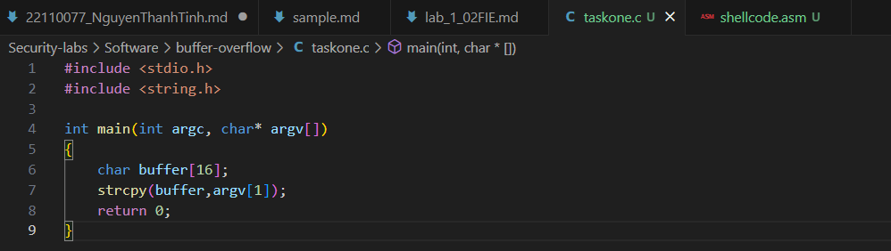
and the file shellcode.asm will contains the shellcode in asm. This shellcode add a new entry in hosts file.
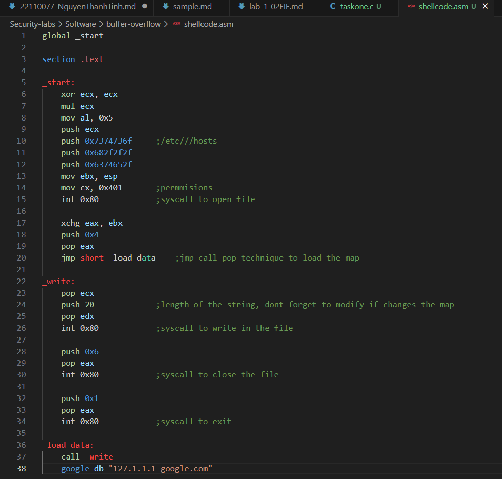

## 2. Compile asm program and C program to executable code.
For this lab, i will use a docker container to do. It will be mapped to my Seclabs directoy:
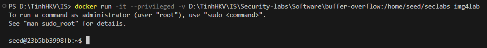
Then i will compile C asm program and C program to executable code:
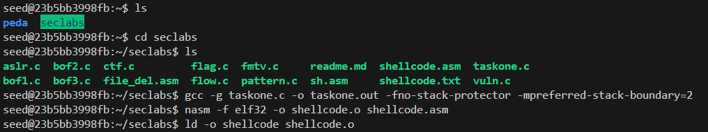

## 3.  Conduct the attack so that when C executable code runs, shellcode will be triggered and a new entry is  added to the /etc/hosts file on your linux.
Before i attack, here is the stackframe of the main function:
> 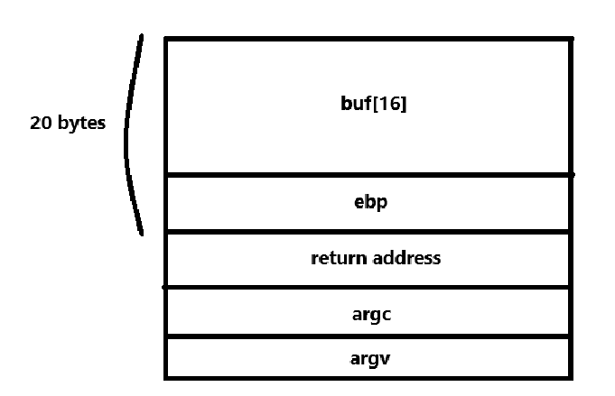

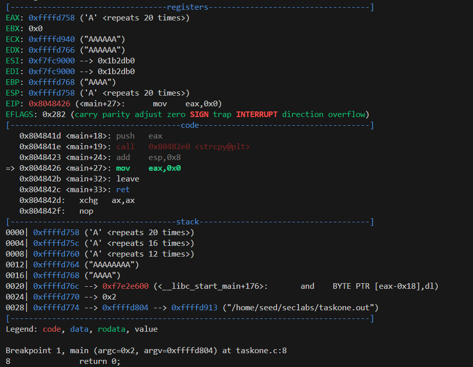
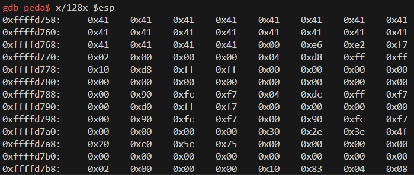

The 0x41 values (which are ASCII 'A') represent the overflowed buffer. You have filled the buffer with 20 'A's as intended.

# Task 2: Attack on the database of Vulnerable App from SQLi lab 
- Start docker container from SQLi. 
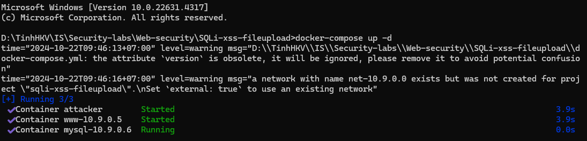
- Install sqlmap.
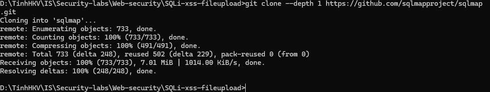
- Write instructions and screenshots in the answer sections. Strictly follow the below structure for your writeup. 

**Question 1**: Use sqlmap to get information about all available databases
**Answer 1**:
first i open the command prompt and cd to the extracted folder.
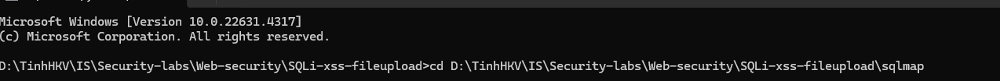
then i run sqlmap to Retrieve Databases:
> `python sqlmap.py -u "http://localhost:3128/unsafe_home.php?username=admin&Password=anything' OR '1'='1" --dbs`

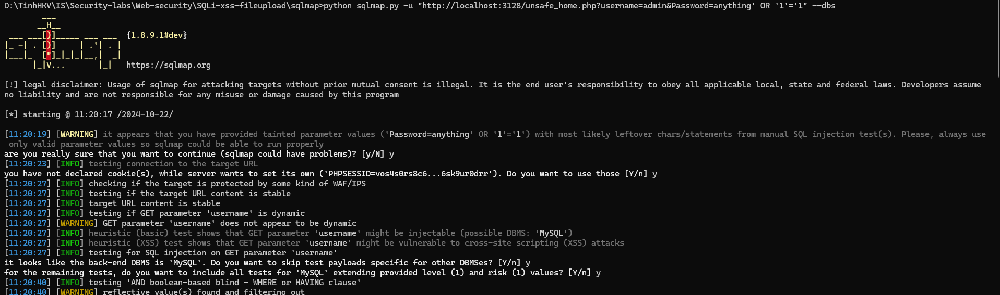

